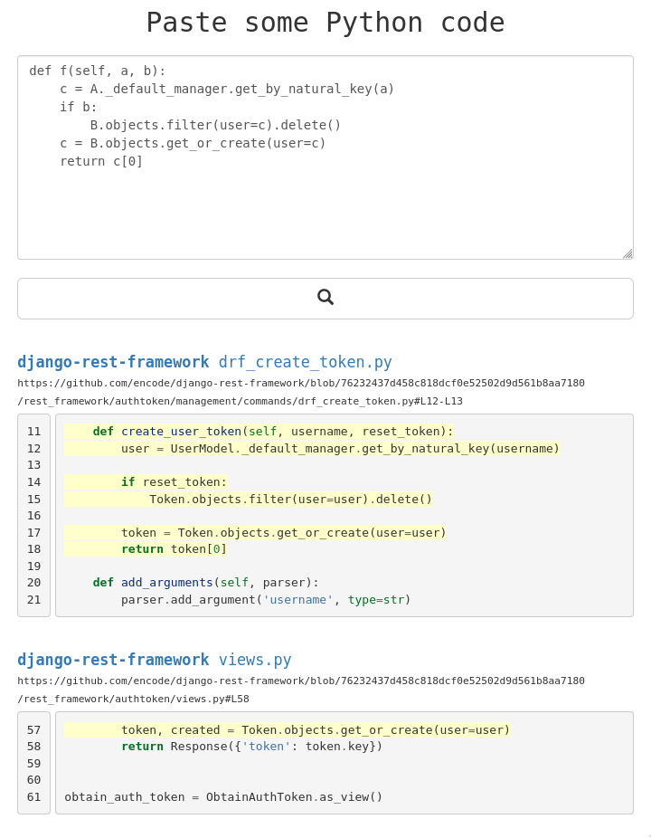

Work in progress

TODO:
* replace ast subtree string tokens by their (weak) hash values
* instead of storing the indexed contents in the index, replace the contents with a reference to an unique id of the contents on disk
* make index robust with housekeeping functions etc, automated index update
* git clone --depth 1
